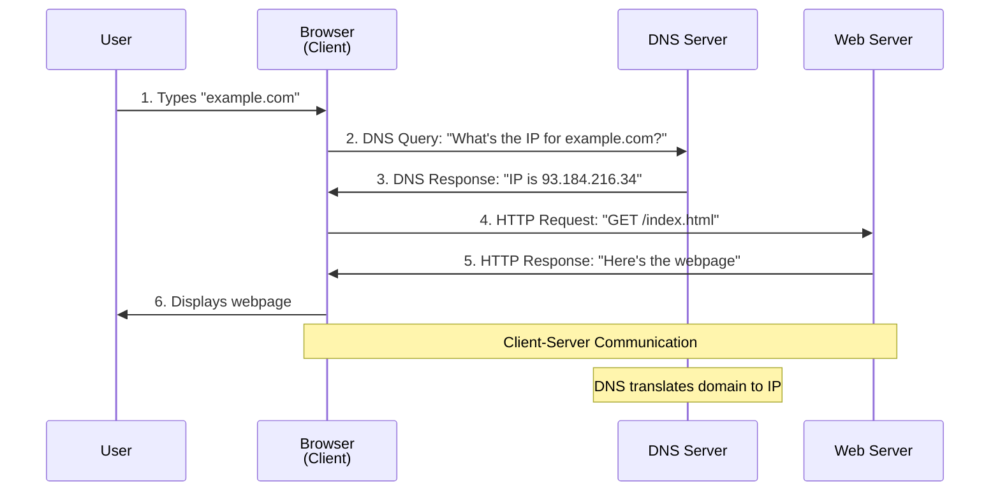

# How the Web Works - Request Response Cycle

The web operates on a simple **client-server model** where your browser (client) requests information from web servers, which then send back responses.

## Basic Steps:

1. **User Action** - You type a URL or click a link
2. **DNS Resolution** - Browser asks DNS servers to convert the domain name (like "google.com") into an IP address (like "172.217.164.142")
3. **HTTP Request** - Browser sends a request to that IP address asking for the webpage
4. **Server Processing** - The web server receives the request and prepares the response
5. **HTTP Response** - Server sends back the webpage data (HTML, CSS, images)
6. **Rendering** - Browser displays the webpage to you

## DNS Role:

DNS acts as the internet's address book - it's the crucial first step that tells your browser which server to contact. Without DNS, you'd need to memorize IP addresses instead of using friendly domain names.

## Client-Server Relationship:

-   **Client** (your browser) = makes requests
-   **Server** (web server) = provides responses
-   Communication happens over HTTP/HTTPS protocols

