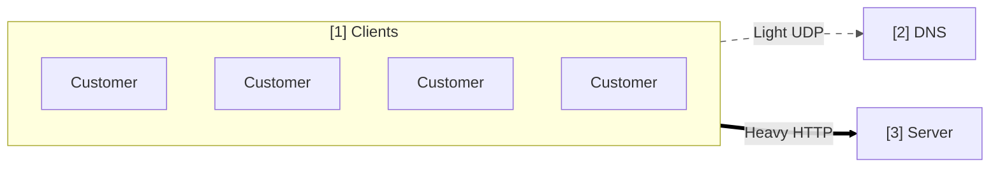

# Single Server Configuration

It is the simplest configuration possible and this is how many small projects get started. It runs the entire application on a single machine.

Any web pages, images, CSS files, videos have to be generated or served by the same single server. And all the traffic and processing will have to be handled by the same machine.

Small websites or applications may not need a dedicated server and can often be hosted on a virtual private server(VPS) or on shared hosting.

> Virtual prvate server is a term used by hosting providers do describe a virtual machine for rent. When you a purchase VPS instance, it is hosted together with other VPS instances on a shared host machine. VPS behaves as a regular server - tou have your own operating system and full privileges. You can add more RAM and CPU power with a click of a button.

> Shared hosting is cheapest hosting solution, where you purchase a user account without administrative privileges. Your account is installed on a server together with many other customers' accounts.

