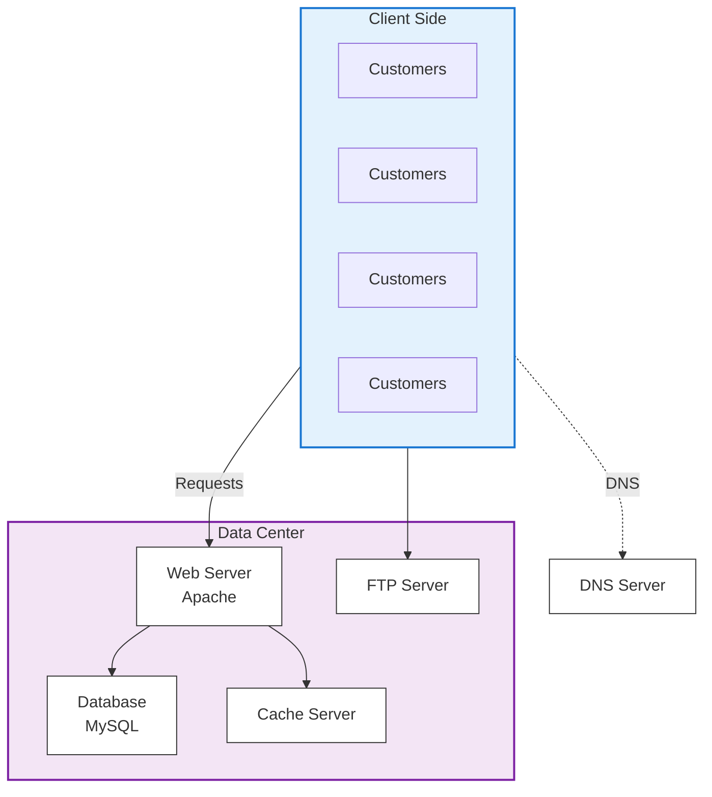

# Isolation of Services

Vertically scalability is not the only option at this eary state of evolution. Another simple solution is moving different parts of the system to separate physical servers by installing each type of services on a separate physical machine.

In this context, a service is an application like a web server (for example, Apache) or database engine (for example, MySQL). This gives your web server and database a separate, dedicated machine.

In the same manner, you can deploy other services like File Transfer Protocol, DNS, cache, and others, each on a dedicated physical machine.

> Cache is server/service focused on reducing the latency and resources needed to generate the result by serving previously generated content. Caching is a very important teachnique for scalability. We will discuss it in detail in Chapter 6.

> The core concept behind isolation of services is that you should try to split your monolithic web application into a set of distinct functional parts and host them independently. It is called **functional partitioning**

