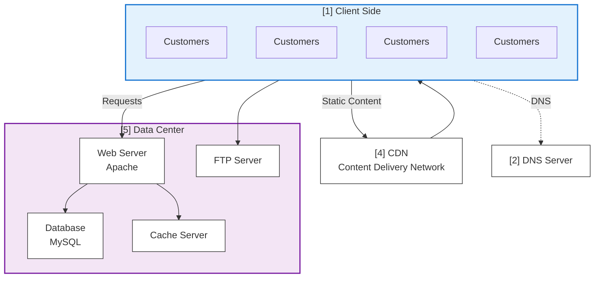

# Content Delivery Network: Scalability of Static Content

As application grow and get more customers, it becomes beneficial to offload some of the traffic to a third-party content delivery network(CDN) service.

A content delivery network (CDN) is a hosted service that takes care of the global distribution of static files such as images, JavaScript, CSS, and videos. It works as an HTTP proxy, sitting between clients and the origin server.

Clients that need to download a file first connect to the CDN server closest to their geographical location. If the requested file is not already available there, the CDN fetches it from the origin server, delivers it to the client, and caches a copy locally.

Once the file is cached by the CDN, subsequent requests for the same file from nearby clients are served directly from the CDN server instead of traveling all the way back to the origin. This reduces latency, speeds up page load times, and lowers bandwidth usage on the origin server.

CDNs are widely used to improve website performance, ensure high availability, and provide resilience against traffic spikes or distributed denial-of-service (DDoS) attacks.

As a result, your servers and networks have to deal with reduced traffic, and since CDNs solve a specific problem, they can optimize the way they serve the content cheaper than you could. We will explain CDN in more detail in Chapter 6.

## Popular CDN Providers

| Provider                | Key Strengths                                   | Best Use Cases                            |
| ----------------------- | ----------------------------------------------- | ----------------------------------------- |
| **Akamai**              | Largest global reach, strong enterprise support | Large enterprises, global web apps        |
| **Cloudflare**          | CDN + DNS + security + DDoS protection          | Websites needing performance + security   |
| **Amazon CloudFront**   | Deep AWS integration, scalable pay-as-you-go    | Apps hosted on AWS, streaming, APIs       |
| **Google Cloud CDN**    | Integrated with Google Cloud, fast edge caching | Sites on Google Cloud, media delivery     |
| **Microsoft Azure CDN** | Azure ecosystem, enterprise-grade SLAs          | Apps/services hosted on Azure             |
| **Fastly**              | Real-time caching, instant purge, edge logic    | Dynamic sites, APIs, real-time apps       |
| **StackPath**           | CDN + edge computing, security features         | Edge workloads, small to mid businesses   |
| **KeyCDN**              | Developer-friendly, simple pricing              | Developers, smaller projects              |
| **Bunny.net**           | Low cost, easy setup, global POPs               | Budget-friendly websites, startups        |
| **CacheFly**            | Optimized for video streaming + large files     | Video, software downloads, media sites    |
| **Imperva**             | CDN with WAF and security-first approach        | Apps needing strong security + compliance |
| **CDNetworks**          | Strong presence in Asia                         | Businesses targeting Asian markets        |
| **ChinaCache**          | Focused on mainland China                       | Companies delivering content in China     |

