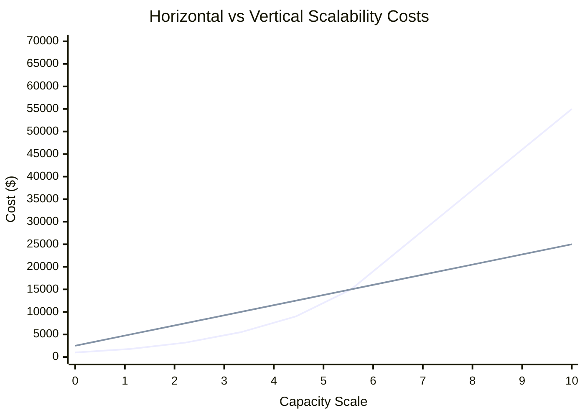

# Distributing the Traffic: Horizontal Scalability

All of the evolution stages discussed so far were rather simple modifications to the single-server configuration. **Horizontal scalability**, on the other hand, is much harder to achieve and in most cases it has to be considered before the application is built. In some rare cases, it can be “added” later on by modifying the architecture of the application, but it usually requires significant development effort. I will describe different horizontal scalability techniques throughout this book, but for now, let’s think of it as running each component on multiple servers and being able to add more servers whenever necessary. Systems that are truly horizontally scalable do not need strong servers—quite the opposite; they usually run on lots and lots of cheap “commodity” servers rather than a few powerful machines.

---

**Horizontal scalability is accomplished** by a number of methods to allow increased capacity by **adding more servers**. Horizontal scalability is considered the holy grail of scalability, as it overcomes the increasing cost of capacity unit associated with scaling by buying ever-stronger hardware. In addition, when scaling horizontally you can always add more servers—you never reach a hard limit, as is the case with vertical scalability.

---

Horizontal scalability technologies often pay off at the later stage. Initially they tend to cost more because they are more complex and require more work. Sometimes they cost more because you need more servers for the most basic setup, and other times it is because you need more experienced engineers to build and operate them. The important thing to note is that once you pass a certain point of necessary capacity, horizontal scalability becomes a better strategy. Using horizontal scalability, you avoid the high prices of top-tier hardware and you also avoid hitting the **vertical scalability ceiling** (where there is no more powerful hardware).

---

It is also worth noting that scaling horizontally using third-party services like CDN is not only cost effective, but often pretty much transparent. The more traffic you generate, the more you are charged by the provider, but the cost per capacity unit remains constant. That means that doubling your request rate will just cost you twice as much. It gets even better, as for some services, price per unit decreases as you scale up. For example, Amazon **CloudFront** charges $0.12 per GB for the first 10TB of transferred data, but then decreases the price to $0.08 per GB.

---

> **HINT**
> Cloud service providers are able to charge lower rates for higher-traffic clients because their overheads of maintenance, integration, and customer care are lower per capacity unit when dealing with high-traffic sites.

---

## Round-robin DNS

Round-robin DNS is a DNS server feature allowing you to resolve a single domain name to many IP addresses. The regular DNS server takes a domain name (for example, web.mysite.com) and resolves it to a single IP address (123.23.5.121). Round-robin DNS, on the other hand, resolves a domain name to multiple IP addresses (corresponding to different machines). Then, each time a client requests the domain name, the DNS server responds with a different IP address from the pool of valid IP addresses. This can help distribute client requests among several machines. This is not real traffic management, as each client will communicate with only one of the web servers, and if the client may later resolve an IP address, it will only communicate with the selected server.

---

**Comparison of vertical and horizontal scaling costs**

-   Vertical scalability costs rise sharply after a certain point.
-   Horizontal scalability becomes much more efficient after a certain point.
-   Initial costs associated with horizontal scalability tend to be higher.
